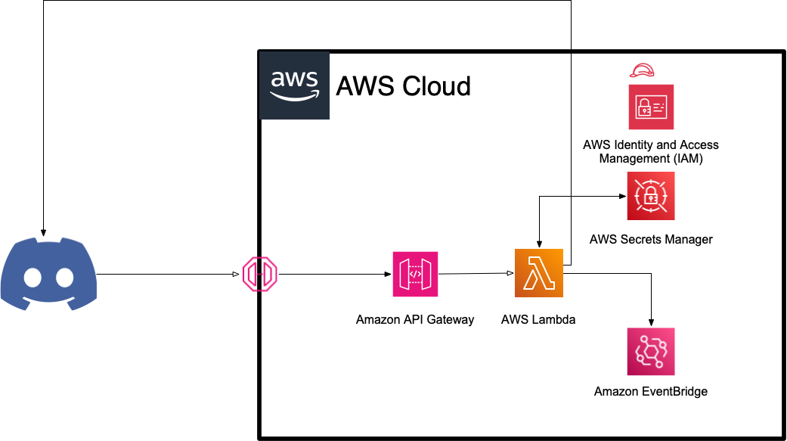
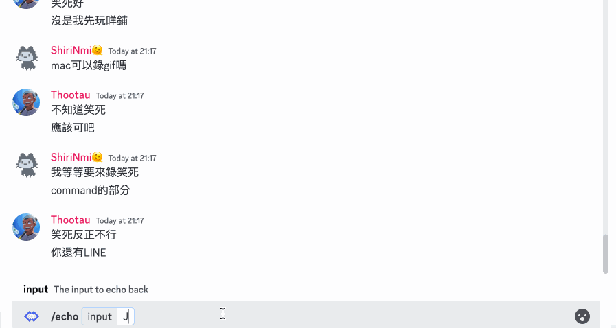
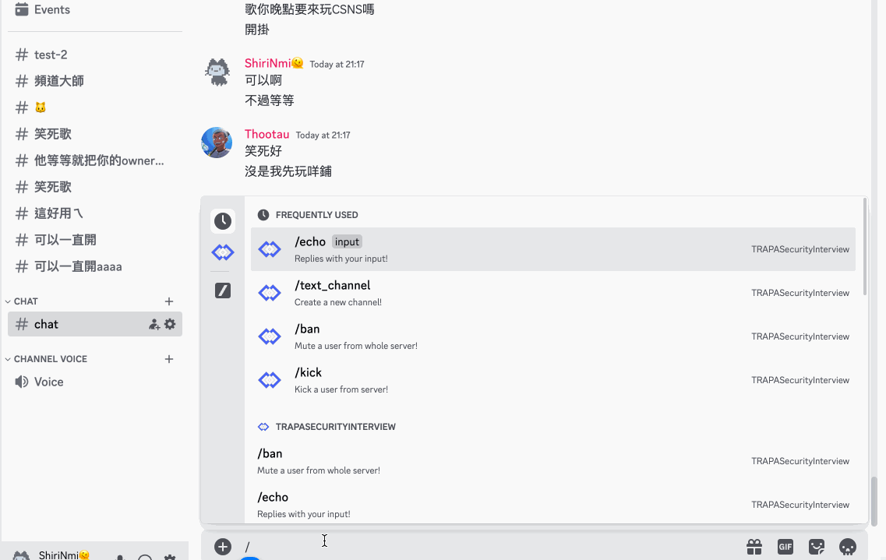
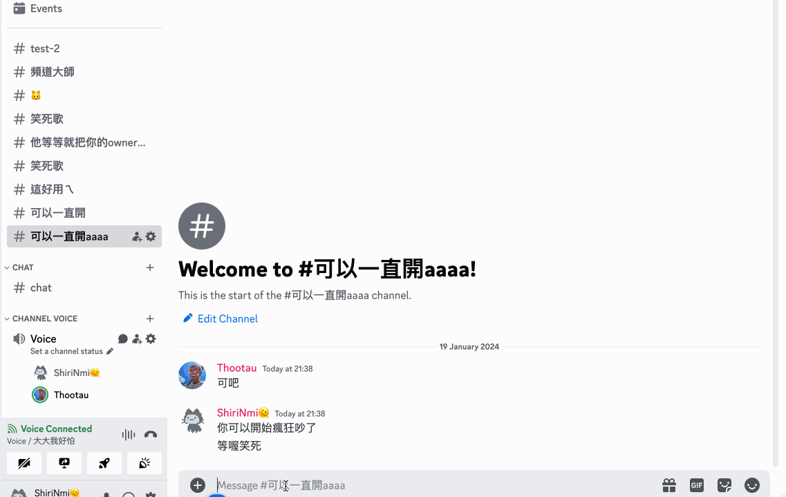
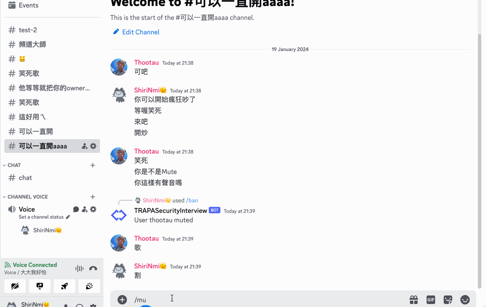
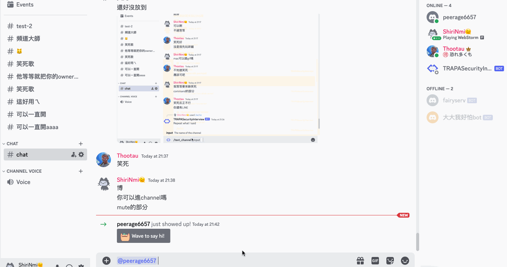

# TRAPASecurityInterview

  
  
A project for the TRAPA Security Interview  
Presents a simple Discord bot that implements a few slash commands.
## Tech-Stack
- [Discord.js](https://discord.js.org/#/)
- [Serverless Framework](https://www.serverless.com/)
- [Amazon Web Services](https://aws.amazon.com/)
  - [Lambda](https://aws.amazon.com/lambda/)
  - [API Gateway](https://aws.amazon.com/api-gateway/)
  - [Secrets Manager](https://aws.amazon.com/secrets-manager/)
  - [IAM](https://aws.amazon.com/iam/) (Handled by Serverless Framework)
  - [CloudWatch](https://aws.amazon.com/cloudwatch/) (Handled by Serverless Framework)
  - [CloudFormation](https://aws.amazon.com/cloudformation/) (Handled by Serverless Framework)
  - [EventBridge](https://aws.amazon.com/eventbridge/)
## Architecture

## Demonstration
### Slash Commands
#### Echo

#### Text Channel

#### Mute

#### Mute (When user is not in a voice channel)

#### Kick
